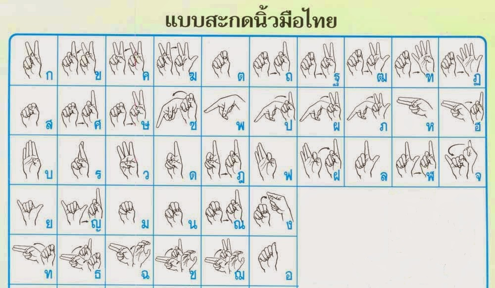
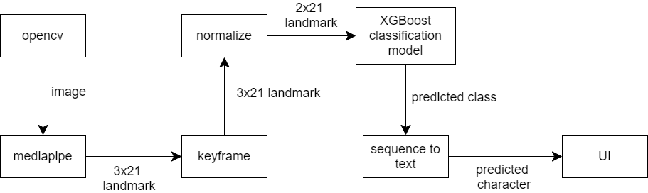
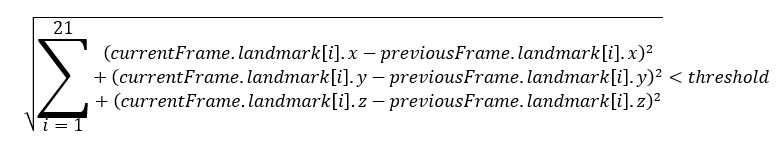

# Real-time Thai fingerspelling interpreter

## Background
ผู้พิการทางการได้ยินมักต้องประสบปัญหาในการสื่อสารกับผู้คนที่ไม่รู้จักภาษามือ การนำโปรแกรมคอมพิวเตอร์เข้ามาช่วยแก้ปัญหานี้จะทำให้เราสามารถสื่อสารกับผู้พิการได้ง่ายขึ้น

## Scope
* รองรับพยัญชนะไทย 42 ตัว (ตัวอักษร ฃ และ ฅ ไม่มีกำหนดเอาไว้)
* แสดงผลลัพธ์แบบ real-time
<p align="center">

</p>

## Dataset Preparation
เราทำการจำแนกการสะกดพยัญชนะไทยออกเป็น 26 class เนื่องจากมีหลายพยัญชนะที่มีการออกท่าทางที่ซ้ำกัน เพื่อให้ง่ายต่อการจัดการข้อมูลและออกแบบ model เราจึงเลือกมาเฉพาะท่าที่ไม่ซ้ำกัน

26 class ได้แก่ ["1", "2", "3", "4", "5", "ก", "ง2", "จ1", "จ2", "ฉ1", "ซ2", "ด", "ต", "ท1", "น", "บ", "พ", "ฟ", "ม", "ย", "ร", "ล", "ว", "ส", "ห", "อ"]

จากนั้นเราเก็บภาพท่าทางของแต่ละ class อันละ 24 ภาพ ประกอบไปด้วย ภาพที่เห็นหน้าและภาพที่ไม่เห็นหน้าอย่างละ 12 ภาพ

## Application Workflow
<p align="center">

</p>
### OpenCV
เรารับข้อมูลภาพมาจาก OpenCV โดยตั้งค่าให้รับค่าจาก webcam

### MediaPipe
MediaPipe เป็น open-source ที่ช่วย extract feature ออกมาจากภาพ ในที่นี้เรานำมาใช้เพื่อช่วย extract ภาพที่เราได้จาก OpenCV

หลักการทำงานเบื้องต้นคือ MediaPipe จะทำ Palm Detector เพื่อหาขอบเขตของมือในภาพ จากนั้นนำไปเข้า Hand Landmark Model เพื่อระบุ keypoint ทั้ง 21 จุด โดยแต่ละจุดประกอบไปด้วยตัวเลข 3 ตัวแทนพิกัดในแกน x, y, z

### Keyframe
ข้อมูลที่ได้จาก MediaPipe มีลักษณะคือ ใน 1 frame ถ้าปรากฎมืออยู่จะมีพิกัดของตำแหน่งต่าง ๆ ในมือ รวม 63 จุด

ข้อมูลที่ได้มานั้นค่อนข้างหยาบและใช้งานยาก เพราะ MediaPipe จะเก็บข้อมูลจากทุก frame รวมถึง transition frame ด้วย เราจึงต้องหา key frame ก่อนจะนำไปเข้า classification model

ตำแหน่งทั้ง 21 จุดของ frame ปัจจุบันจะถูกเปรียบเทียบกับ frame ก่อนหน้า ดังสมการ

<p align="center">

</p>

โดยที่ threshold คือค่าที่ได้จากการทดลองเพื่อให้ได้ปริมาณ keyframe ที่เหมาะสม

ถ้า frame ดังกล่าวถูกต้องตามสมการและปรากฎอยู่จนครบจำนวน frame ที่กำหนด frame นั้นจะถูกนับว่าเป็น keyframe
จำนวนดังกล่าวสามารถเปลี่ยนได้ ยิ่งมีจำนวนเยอะหมายความว่าผู้ใช้งานต้องค้างท่านานขึ้นตามไปด้วย

### Normalize
ตำแหน่งที่ได้จาก MediaPipe คือตำแหน่งของจุดในภาพ แต่ภาพจากกล้องสามารถมีขนาดได้หลากหลาย เราจึงต้อง normalize ข้อมูลเพื่อให้ model ของเราใช้งานได้ในหลากหลายสถานการณ์

จากการ explore dataset เราเห็นตรงกันว่าข้อมูลในแกน z ซึ่งมีความหมายถึงระยะห่างของจุดดังกล่าวเมื่อเทียบกับตำแหน่งข้อมือ ค่อนข้างไม่มีประโยชน์และอาจทำให้ model เกิดปัญหาได้ เราจึงตัดแกน z ออกไป แต่ละจุดจึงเหลือเพียงแค่ค่า x, y

ต่อมาเรา crop มือออกมาจากภาพใหญ่และเปลี่ยนตำแหน่ง x, y ทั้งหมดให้เป็นอัตราส่วนเมื่อเทียบกับขนาดของภาพที่ตัดมาแล้ว ค่า x, y ที่ผ่านขั้นตอนนี้จะมีช่วงอยู่ระหว่าง [0, 1]

### Classification Model
Model ที่เราเลือกใช้ คือ decision tree และเราเลือก implement ด้วย XGBoost

ในขั้นตอนการสร้าง model เราแบ่ง dataset ออกเป็น train dataset และ test dataset ในอัตราส่วน 4:1
และใช้ training parameter ดังนี้
```
{
'booster': 'gblinear',
'objective': 'multi:softprob',
'eval_metric': 'merror',
'num_class': 26
}
```
เรา train ทั้งหมด 100 epoch โดยมี early stopping อยู่ที่ 50

ข้อมูลเข้า คือ landmark (x, y) 21 จุดที่ normalize แล้ว
ข้อมูลออก คือ predicted class (จาก 26 class)

### Sequence to Text
ข้อมูลที่เราได้จาก classification model จะอยู่ในรูปแบบของ class ที่เรากำหนดขึ้นมาเพื่อให้ง่ายต่อการทำงาน ดังนั้นเราจึงต้องแปลงข้อมูลเหล่านั้นให้กลายเป็นตัวอักษร

การสะกดนิ้วมือบางตัวต้องการท่าต่อเนื่องมากกว่า 1 ท่า เช่น 'ก' ตามด้วย '1' จะได้ 'ข'
ในการแก้ปัญหานี้เราเลือกใช้ state machine

### UI
โปรแกรมของเราทำงานด้วย Python และใช้ library จาก Tkinter และเพื่อเพิ่มประสิทธิภาพในการทำงาน เราแบ่งการคำนวณของ model ให้แยกไปเป็นอีก thread หนึ่งต่างหาก

## Demonstration

## Limitation
* โปรแกรมนี้รองรับการแปลภาษาแค่มือขวาเท่านั้น เนื่องจาก dataset ทั้งหมดเป็นมือขวา
* พยัญชนะบางตัวมีท่าทางการสะกดที่คล้ายคลึงกัน โปรแกรมอาจสับสนได้ง่าย เช่น 'ก' และ 'ด'
* workflow ของโปรแกรมนี้มี MediaPipe เป็นตัวหลัก ดังนั้นหากเป็นสภาพแวดล้อมที่ MediaPipe มีประสิทธิภาพน้อย ย่อมส่งผลถึงตัวโปรแกรมเช่นกัน เช่น บริเวณรอบข้างมีแสงน้อยก็อาจทำให้หาตำแหน่งต่าง ๆ ของมือไม่เจอ
